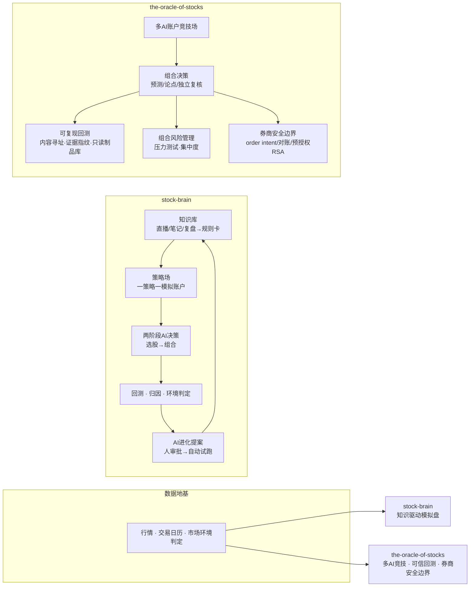

# stock-quant — 个人版 A 股量化研究与模拟交易系统

> 一套面向个人/本地部署的 A 股量化研究与模拟交易系统，由两大模块组成。本项目**只用于量化研究与模拟盘**，不构成任何投资建议；真实资金执行默认关闭。

## 架构总览

## 模块

- **stock-brain**（量化智库）：**知识驱动的模拟盘** —— 把用户积累的股市知识（直播转写、笔记、交易复盘、人机共研结论）沉淀为知识库，策略从知识库选取"知识子集"驱动独立模拟账户交易，结果回灌验证并驱动策略自我进化。
- **the-oracle-of-stocks**（股神实验室）：**多 AI 账户竞技场 + 可信回测 + 券商安全边界** —— 多个 AI 账户（可配不同模型）在真实行情下独立决策、互相比较；自带可复现回测体系与面向真实券商接入的生产级安全/风控/审计边界。

两者共享"行情 + 交易日历 + 市场环境判定"这套数据地基（一套系统的两个方向）。

## 技术栈

- **后端**：TypeScript + Node 22+（内置 `node:sqlite`，无 ORM，全手写 SQL）
- **前端**：React 19 + Vite + lightweight-charts（K线） + lucide-react
- **运行**：tsx 直跑 / Express / 生产单机

## 核心能力

### stock-brain（知识进化闭环）
- **知识库**：导入直播转写/笔记/交易复盘；AI 蒸馏成结构化"规则卡"；自动标注风格/行业/环境/置信度；胜率归因与"待验证→启用→退役"生命周期。
- **策略场**：按交易风格（短线/波段/中线/长线）建策略，一策略一独立 100 万模拟账户；AI 推荐知识子集。
- **决策引擎**：两阶段 LLM 决策（选股 → 组合逐票），每笔带四段动机；程序化执行校验（T+1、手数、涨跌停、风险预算、行业集中度、止损/止盈）。
- **环境判定 / 事件台账 / 回测 / 策略进化**：量能档位+市场宽度+赚钱效应判定攻守；新闻事件次日板块反应结算；规则回放+AI 抽样回放（防未来函数）；周日 AI 生成进化提案、人审批后自动试跑。

### the-oracle-of-stocks（工程化量化研究平台）
- **多 AI 竞技场**：多个 AI 账户同场，AI 选股 + 个股深度研究（行情/基本面/新闻/Alpha 信号）→ 组合决策（预测/论点/审计 + **独立投研委员会双重复核** + 置信度校准）。
- **横截面 Alpha 模型**：岭回归 + 样本外 walk-forward 验证 + 选择提升度度量。
- **可复现回测**：规则 / AI 决策回放 / Alpha 样本外验证三类；数据集与结果 manifest 固化 + 自动复现校验；**内容寻址、只读、带证据指纹的回测制品库** + 持久化审计（全量哈希/副本同步/恢复演练/孤儿隔离）。
- **组合风险管理**：风险快照、压力测试、集中度（HHI/行业/相关性）、组合优化。
- **券商安全边界**：order intent 全生命周期、执行报告 attestation、持仓/结算对账、订单事件流与接管、预交易风险授权 + RSA attestation、执行闸门/联锁、风险规则发布治理。
- **系统完整性**：schema 迁移安全（锁+备份+排空+恢复）、数据库持久化检查、运行态监控、行情/时间权威、信任密钥、大量单元测试。

## 设计与工程亮点

- **可审计 AI 投资决策**：决策可追溯（知识引用 + 动机 + 委员会复核），LLM 只出意图、由程序约束执行。
- **知识驱动 + 自我进化**：把个人沉淀变成可自我淘汰的知识资产。
- **防篡改回测**：内容寻址 + 证据指纹 + 只读 + 副本 + 持久化审计，回测结果可信、可复现。
- **安全的券商接入边界**：为将来安全接入真实券商量身准备了极细的授权/对账/风险/审计边界。
- **大量单元测试**：关键模块（回测/制品/安全/权威）均有配套测试。

## 安全与免责

- **默认 PAPER/SANDBOX**：真实资金执行关闭，仅为量化研究与模拟盘；接入真实券商需显式开启并满足安全验收。
- **本地单机**：面向本地/内网部署，无登录（stock-brain）或仅登录（Oracle）；请勿直接暴露公网。
- 本项目是学习/研究性作品，**不构成投资建议**。

> 注：仓库为公开的作品集；核心交易策略、AI 模型细节、真实数据与凭证**不在此公开**。
